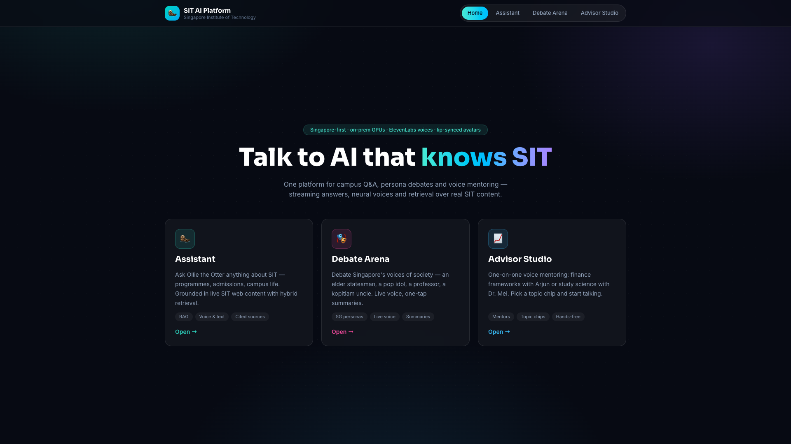
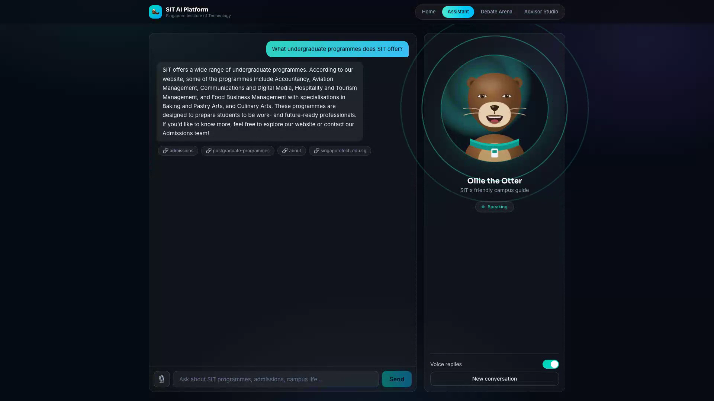
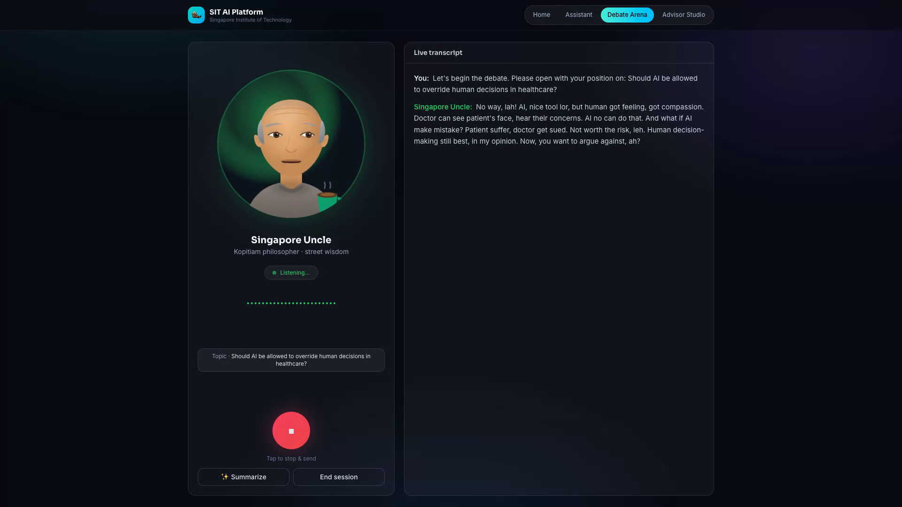
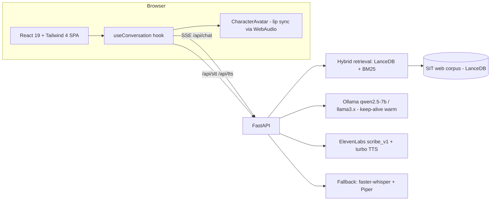

# SIT AI Platform

**One unified conversational-AI platform for the Singapore Institute of Technology** — a
campus assistant grounded in real SIT web content, a persona debate arena, and a voice
mentoring studio, with lip-synced avatars, Singaporean voice profiles, and real-time
streaming throughout.

> 🎬 **[Watch the demo video](demo/SIT_AI_Platform_Demo.mp4)** (3 min, 1080p, narrated) ·
> 📊 **[Slide deck](docs/SIT_AI_Platform_Slides.pptx)** (12 slides, PowerPoint — source in [SLIDES.md](SLIDES.md))

This platform is a ground-up redesign that consolidates four earlier prototypes
([AI-debate-bot](https://github.com/Finance-LLMs/AI-debate-bot),
[SIT-chatbot](https://github.com/Finance-LLMs/SIT-chatbot),
[Institute-Chatbot-RAG](https://github.com/Finance-LLMs/Institute-Chatbot-RAG),
[Personality-Voice-Interaction](https://github.com/Finance-LLMs/Personality-Voice-Interaction))
into a single modern codebase.



## Modules

| Module | What it does |
|---|---|
| 🦦 **Assistant** | Ask Ollie the Otter anything about SIT. Hybrid RAG (LanceDB vectors + BM25) over scraped SIT pages, token-streamed answers with cited sources, voice in and out. |
| 🎭 **Debate Arena** | Live spoken debates against Singapore's voices of society — Mr. Tan (elder statesman), Jia Hui (pop idol), Prof. Devi (public intellectual), Singapore Uncle (kopitiam philosopher). One-tap debate summaries. |
| 🎧 **Advisor Studio** | One-on-one voice mentoring tuned for Singapore: Arjun on CPF/HDB/investing, Dr. Mei on learning science and exam strategy. |

| Assistant (RAG + sources) | Debate Arena |
|---|---|
|  |  |

## Highlights

- **Lip-synced avatars** — semi-realistic parametric SVG characters whose jaw, lips and
  teeth articulate from a live WebAudio analysis of the speech signal (energy envelope →
  jaw, high-frequency share → lip spread). Blinking, gaze drift and breathing included.
- **Singaporean voice profiles** — per-persona ElevenLabs voices chosen from the voice
  library (Singlish-friendly for Uncle), mapped in `backend/el_voices.json`, with a fully
  local Piper/Whisper fallback when no API key is set.
- **Low latency** — replies are spoken **sentence-by-sentence while the rest is still
  streaming**; chat models stay warm (`keep_alive`), and short conversational turns can
  route to a small fast model (`CHAT_MODEL_FAST`). First audio ≈ 2 s after send.
- **Real retrieval** — hybrid vector + BM25 over a LanceDB index of SIT web pages
  (crawler renders pages in real Chrome to get past the site's JS challenge), with an
  SIT abbreviation expander (IWSP, SNAIC, AAI…). The ready-built index ships in
  `backend/data/`.
- **Tested end-to-end** — `demo/test_e2e.py` drives the real app in Chrome with a fake
  microphone through all three modules (12 checks, including the full
  speak → transcribe → reply → summarize loop). `backend/test_smoke.py` covers the API.
- **Automated demo production** — Playwright records a scripted 1080p walkthrough while
  the backend captures every spoken clip; `make_video.py` rebuilds the soundtrack on the
  real timeline with narration that is scheduled overlap-free and sidechain-ducks the
  product audio.

## Architecture



Single process, single port: FastAPI serves the built SPA and all APIs.

## Quick start

```bash
# backend
python3.11 -m venv .venv
.venv/bin/pip install -r backend/requirements.txt
cp backend/.env.example backend/.env         # add ELEVENLABS_API_KEY for cloud voices

# frontend
cd frontend && npm install && npm run build && cd ..

# models (local fallback stack)
ollama pull llama3.2:3b && ollama pull nomic-embed-text
# piper voices (only needed without an ElevenLabs key):
#   download *.onnx voices from rhasspy/piper-voices into backend/voices/

# run
cd backend && set -a && . ./.env && set +a && \
  CHAT_MODEL=llama3.2:3b ../.venv/bin/uvicorn app:app --port 8080
# open http://localhost:8080
```

Rebuild the RAG index (headless Chrome required): `cd backend && python ingest.py 40`
Re-pick ElevenLabs voices: `cd backend && python setup_elevenlabs.py` (writes `el_voices.json`;
audition clips for every persona are in `demo/voice_samples/`).

## Testing

```bash
cd backend && ../.venv/bin/python test_smoke.py      # API smoke tests
cd demo && ../.venv/bin/python test_e2e.py           # full browser E2E (fake mic)
```

## GPU-server deployment

`deploy/deploy.sh` rsyncs the project to the lab server, builds a conda env on the NAS,
starts a user-level Ollama (models on NAS) and runs uvicorn with faster-whisper on CUDA.
`deploy/run_server.sh` is the idempotent (re)start used on the box.

## Environment variables

| Variable | Purpose | Default |
|---|---|---|
| `ELEVENLABS_API_KEY` | Cloud STT/TTS with Singaporean voices | unset → local stack |
| `OPENAI_API_KEY` | Use OpenAI instead of Ollama for chat | unset → Ollama |
| `CHAT_MODEL` / `CHAT_MODEL_FAST` | Main / fast-turn Ollama models | `qwen2.5:7b-instruct` / unset |
| `WHISPER_MODEL` / `WHISPER_DEVICE` | Local STT model/device | `base` / `auto` |
| `RAG_DATA_DIR`, `PIPER_VOICES_DIR`, `OLLAMA_URL`, `EMBED_MODEL`, `TTS_CAPTURE_DIR` | See `backend/` modules | sensible defaults |

## Repo map

```
backend/    FastAPI app, RAG, speech, personas, ElevenLabs setup, smoke tests
frontend/   React 19 + Vite + Tailwind 4 SPA (avatars, voice engine, 3 modules)
demo/       E2E suite, demo recorder, video builder, voice samples, final video
deploy/     GPU-server deployment scripts
docs/       Design spec, screenshots; SLIDES.md at repo root for presentations
```
